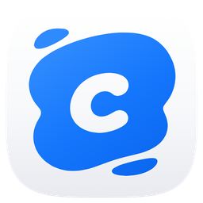
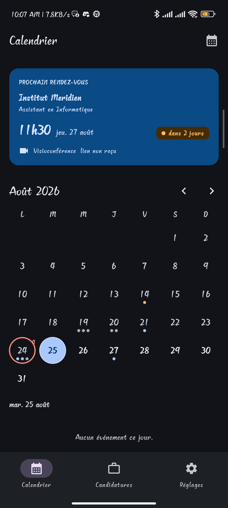
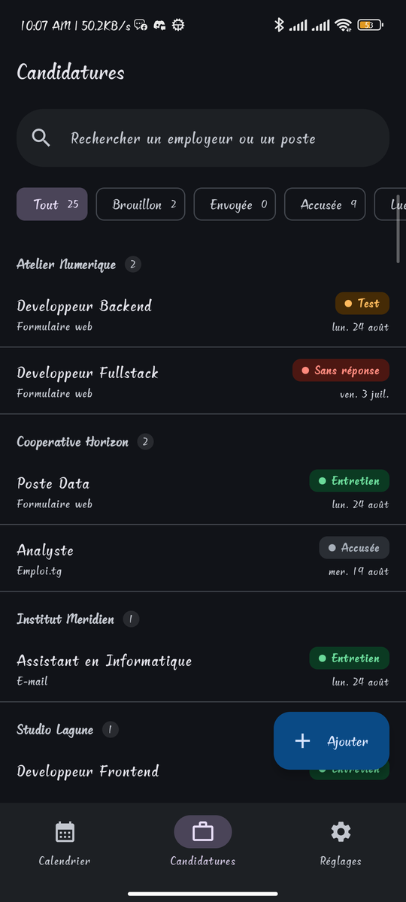
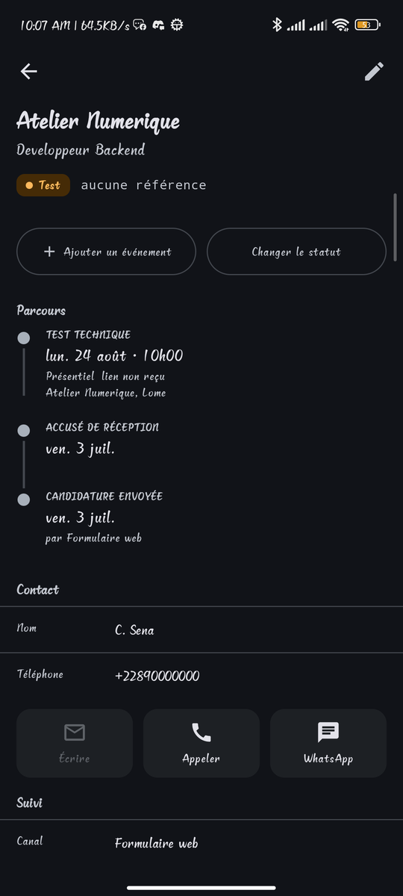

<div align="center">



# JobCalender

[](https://kotlinlang.org)
[](https://developer.android.com)
[](https://github.com/goddivor/jobcalender-mobile/releases)
[](https://github.com/goddivor/jobcalender-mobile/releases)

[](https://developer.android.com/compose)
[](https://m3.material.io)
[](https://developer.android.com/jetpack/androidx/releases/room3)
[](https://dagger.dev/hilt)
[](https://www.mongodb.com/atlas)

[](https://github.com/goddivor/jobcalender-mobile/stargazers)
[](https://github.com/goddivor/jobcalender-mobile/network/members)
[](https://github.com/goddivor/jobcalender-mobile/watchers)
[](https://github.com/goddivor/jobcalender-mobile/graphs/contributors)
[](https://github.com/goddivor/jobcalender-mobile/issues)

Une recherche d'emploi entière dans un seul calendrier : les **candidatures**, le **niveau atteint**
par chacune, et tous les **rendez-vous** qu'elles produisent.

Née d'un problème concret : vingt-cinq candidatures sur six canaux, des réponses qui arrivent par
e-mail et par WhatsApp à toute heure, un entretien et un test passés sans jamais figurer dans le
suivi écrit, et deux rendez-vous qui se sont chevauchés.







</div>

## 🎖️ Fonctionnalités

- **Calendrier mensuel** : les entretiens, tests, réunions et échéances, avec un point coloré par
  famille d'événement sous chaque jour chargé.
- **Détection des conflits d'horaire** : deux rendez-vous qui se recoupent marquent leur journée
  d'un anneau rouge, visible depuis la grille du mois et pas seulement en ouvrant le jour.
- **Prochain rendez-vous en tête d'écran**, avec le temps restant et le lien de visioconférence
  quand il est arrivé.
- **Suivi du niveau atteint** : dix statuts, du brouillon à la décision, sans jamais imposer l'ordre
  de progression, parce qu'une candidature saute parfois une étape.
- **Frise chronologique** par candidature : qui a répondu, quand, et par quel canal.
- **Fonctionne hors connexion** : la base locale fait autorité, la synchronisation n'est qu'une
  sauvegarde et un passage d'un appareil à l'autre.
- **Trois thèmes** : clair, sombre et noir intégral pour les écrans AMOLED.
- **Mise à jour intégrée** depuis les publications GitHub, sans passer par un magasin d'applications.

L'application ne stocke **ni CV, ni lettre, ni e-mail, ni pièce jointe**. Elle garde seulement le nom
du dossier où ces documents vivent sur l'ordinateur : ce sont des traces, pas des archives.

## 📋 Prérequis

- Android 8.0 (API 26) ou plus récent.
- Pour la synchronisation, facultative : une instance de
  [jobcalender-server](https://github.com/goddivor/jobcalender-server) et une base MongoDB Atlas.
  Sans elle, l'application reste pleinement utilisable.

## 📦 Installation

Téléchargez l'APK depuis la
[dernière publication](https://github.com/goddivor/jobcalender-mobile/releases/latest), puis
autorisez l'installation depuis une source inconnue quand Android le demande.

Depuis les sources :

```bash
git clone https://github.com/goddivor/jobcalender-mobile.git
cd jobcalender-mobile
./gradlew assembleDebug
```

La synchronisation exige deux valeurs dans `local.properties`, qui n'est jamais versionné :

```properties
SYNC_CONFIG_URL=https://votre-instance.vercel.app
SYNC_CONFIG_KEY=la-cle-qui-debloque-api-config
```

Sans elles, l'application se construit et fonctionne, simplement sans synchronisation.

## ⚙️ Utilisation

### 📅 Voir ce qui arrive

L'écran Calendrier s'ouvre sur le prochain rendez-vous et le temps qui en sépare. La grille du mois
porte un point par famille d'événement, et un anneau rouge sur les journées où deux choses se
chevauchent.

### 💼 Suivre une candidature

L'écran Candidatures groupe par employeur et se filtre par statut. Un statut sans aucune candidature
reste sélectionnable : un compteur à zéro est une information, pas une raison de le cacher.

Le détail ouvre sur la frise du parcours, puis le contact avec ses actions (écrire, appeler,
ouvrir WhatsApp), le canal et le nom du dossier.

### ✍️ Enregistrer une réponse

Changer un statut laisse une trace dans le parcours. Pour un accusé de réception ou un refus, la date
est celle du jour. Pour un test ou un entretien, la date vit dans la convocation : l'application
ouvre le formulaire d'événement plutôt que d'inventer une date.

### ☁️ Synchroniser

L'application récupère son adresse et son jeton toute seule au premier lancement : aucun jeton ne se
saisit à la main. La synchronisation remplace la copie la plus ancienne par la plus récente, dans un
seul sens, sans fusion. Un échec n'est jamais bloquant.

## 🤝 Contribuer

Les remarques et les propositions sont bienvenues par
[issue](https://github.com/goddivor/jobcalender-mobile/issues) ou par pull request. Le développement
se fait sur `dev` ; `main` ne reçoit que des pull requests, dont le merge déclenche la publication
d'une nouvelle version.

## 📜 Licence

Projet personnel. Tous droits réservés.
